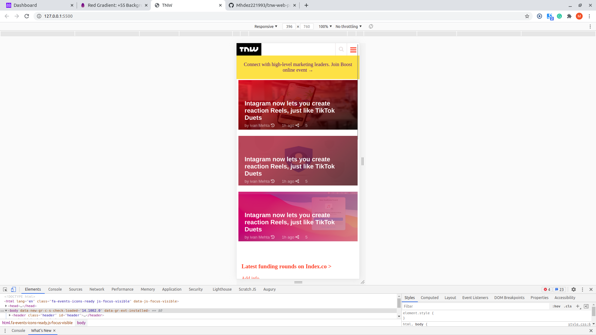
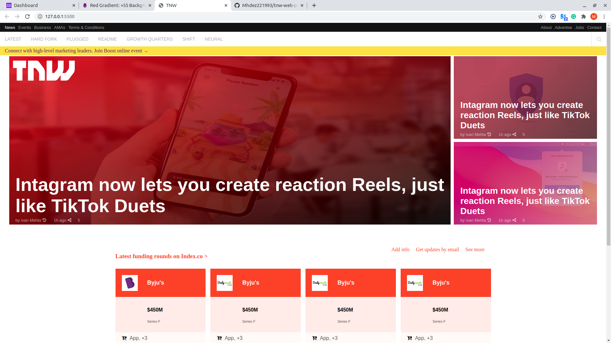

#Tnw Clone

This project is a clone of **The Next Web** website. The primary goal is to master **CSS** and **HTML** technologies by replicating a responsive version of the archived website.
The design focuses on responsiveness and ensuring the site adapts seamlessly to different screen sizes, including mobile and desktop.

## Screenshot

### Mobile


### Desktop


## Built With

- **HTML**
- **CSS**

## Live Demo

[Live Demo Link](https://mhdez221993.github.io/tnw-web-page/)

## How to Get Started

To get a local copy up and running, follow these steps:

### Prerequisites

- A web browser.
- A code editor like Visual Studio Code.
- Git installed on your local machine.
- Node installed on your local machine.

### Installation

1. Clone this repository:

   ```bash
   git clone git@github.com:Mhdez221993/tnw-clone.git
   ```

2. Navigate to the project folder:

   ```bash
   cd tnw-clone
   ```

3. Open the `index.html` file in your browser to view the project.

## Using Stylelint

This project uses **Stylelint** for CSS linting to maintain code quality and consistency.

### .stylelintrc Configuration

The `.stylelintrc` file is already included in the repository. It contains the configuration for Stylelint.

### How to Use Stylelint

1. Ensure you have Node.js installed on your machine.
2. Install Stylelint and its necessary plugins by running:

   ```bash
   npm install stylelint stylelint-config-recommended --save-dev
   ```

3. To lint your CSS files, run:

   ```bash
   npx stylelint "**/*.css"
   ```

4. Fix any auto-fixable issues by running:

   ```bash
   npx stylelint "**/*.css" --fix
   ```

## Author 1

👤 **Bhagyashree Patra**

- GitHub: [@githubhandle](https://github.com/Vagyasri)
- Twitter: [@twitterhandle](https://twitter.com/Lucky86074644)
- LinkedIn: [LinkedIn](https://www.linkedin.com/in/bhagyashree-patra-029bb059/)


## Author 2

👤 **Moises Hernandez**

- GitHub: [@githubhandle](https://github.com/Mhdez221993)
- Twitter: [@twitterhandle](https://twitter.com/MoisesH42060050)
- LinkedIn: [LinkedIn](https://www.linkedin.com/in/moises-hernandez-9bbb17145/)

## 🤝 Contributing

Contributions, issues, and feature requests are welcome!

Feel free to check the [issues page](https://github.com/issues).

## Acknowledgments

- **Microverse** for providing the project inspiration and guidance.
- Original design idea by [The Next Web](https://thenextweb.com/).

## Show your support

Give a ⭐️ if you like this project!